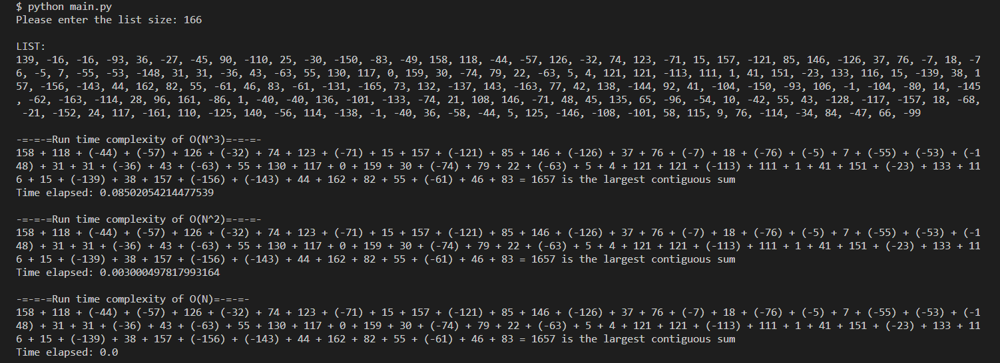

# Sequential Sum

A simple Python script that demonstrates run time complexity by using 3 different functions to calculate the largest contiguous sum in a list.

Make sure [Python](https://www.python.org/downloads/ "Download Python from www.python.org") is installed on your device before opening this file.

## Credits

Alex Akoopie - Creator